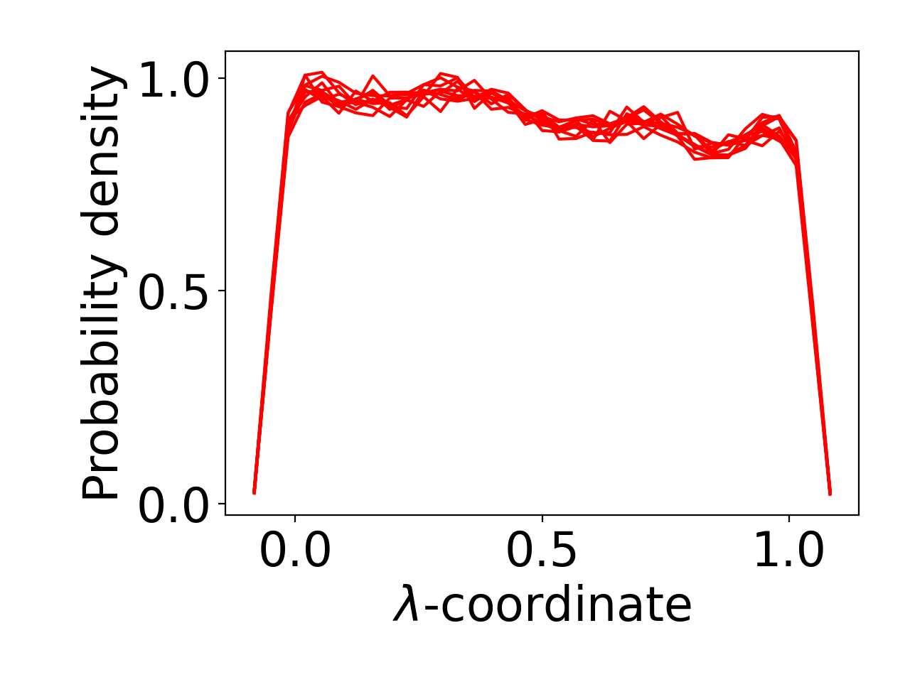

# ARGT_ida

* First replicas of Ida to check the ARGT parameterization.
* dV/dl = -72.630 42.564 -142.322 141.767 -470.985 641.839 
* Start in deprotonated (neutral) state.
* box = 4.37 nm^3, ions = 3 BUF (0.0 mol/L)

# ARGT_boxions_high

* Rerun replicas of ARGT but now with 5 nm box and ions comparable to LYS.
* dV/dl = -72.630 42.564 -142.322 141.767 -470.985 641.839
* Start in protonated (charged) state.
* box = 5.0 nm^3, ions = 11 NA, 12 CL, 3 BUF (0.317 mol/L)

# ARGT_boxions_low

* Rerun replicas of ARGT but now with 5 nm box and ions comparable to LYS.
* dV/dl = -72.630 42.564 -142.322 141.767 -470.985 641.839
* Start in protonated (charged) state.
* box = 5.0 nm^3, ions = 5 NA, 6 CL, 3 BUF (0.155 mol/L)

# ARGT_boxions_none

* Rerun replicas of ARGT but now with 5 nm box comparable to LYS.
* dV/dl = -72.630 42.564 -142.322 141.767 -470.985 641.839
* Start in deprotonated (neutral) state.
* box = 5.0 nm^3, ions = 3 BUF (0.0 mol/L)

# ARGT_boxions_one

* Rerun replicas of ARGT but now with 5 nm box comparable to LYS.
* dV/dl = -72.630 42.564 -142.322 141.767 -470.985 641.839
* Start in protonated (charged) state.
* box = 5.0 nm^3, ions = 3 BUF, 1 CL (0.014 mol/L)

# LYST_ida

* First replicas of Ida to check the LYST parameterization.
* dV/dl = -10957.1 44076.7 -67242.6 48014.3 -16026. 2075.64 6.98266 -707.24 526.209
* box = 4.52 nm^3, ions = 3 BUF

# LYST_bpsi_cpu

* Rerun of the LYST replicas from the best practices SI, only on CPU.
* dV/dl = -10957.1 44076.7 -67242.6 48014.3 -16026. 2075.64 6.98266 -707.24 526.209
* box = 4.93 nm^3, ions = 11 NA, 12 CL, 10 BUF (~0.3 mol/L)
* Pavel says these distributions are flat enough, and similar to earlier results.

# LYST_bspi_gpu

* Rerun of the LYST replicas from the best practices SI.
* dV/dl = -10957.1 44076.7 -67242.6 48014.3 -16026. 2075.64 6.98266 -707.24 526.209
* box = 4.93 nm^3, ions = 11 NA, 12 CL, 10 BUF (~0.3 mol/L)
* Pavel says these distributions are flat enough, and similar to earlier results.

# LYST_reweighted

* Rerun of the LYST replicas from the best practices SI.
* Now with reweighted dV/dl coefficients from LYST_bspi_gpu.
* Reweighting command: `python fit_parameterization.py -f md_cph.mdp -m s -g LYS -fo 8 -o test.txt`
* dV/dl = 62240.648 -234764.266 368714.986 -313597.193 156104.864 -45638.868 7523.61 -1331.275 547.595
* box = 4.93 nm^3, ions = 11 NA, 12 CL, 10 BUF (~0.3 mol/L)

# LYST_pavel

* Rerun of the LYST replicas from the best practices SI.
* Now with reweighted dV/dl coefficients from Pavel (improved fit_parameterization.py).
* dV/dl = -10985.52 44105.334 -67223.723 48005.063 -16043.649 2075.13 18.132 -710.34 526.185
* box = 4.93 nm^3, ions = 11 NA, 12 CL, 10 BUF (~0.3 mol/L)

# TYRT_initreplicas

* Replicas using the initial dV/dl coefficients from Ida (TYRT_par2).
* Ida simulated at pH=9.8, I am simulating here at pH=9.84.
* dV/dl = 349.047 -980.152 762.443 -185.552 -563.210 -263.623 
* box = 5.0 nm^3, ions = 6 NA, 5 CL, 3 BUF (0.155 mol/L)

# TYRT_reweighted
* Replicas using the reweighted dV/dl coefficients from Ida.
* dV/dl = 115.738 -279.821 7.326 187.913 -653.132 -255.462
* box = 4.7 nm^3, ions = 5 NA, 4 CL, 3 BUF

# TYRT_pavelmod
* Parameterization and replicas using the updated force field by Pavel, where the CE1/CE2 dihedral was changed.
* dV/dl = 213.248 -601.327 409.376 -67.214 -569.814 -263.857 (with updated force field)
* box = 5.0 nm^3, ions = 6 NA, 6 CL, 3 BUF (0.165 mol/L)

